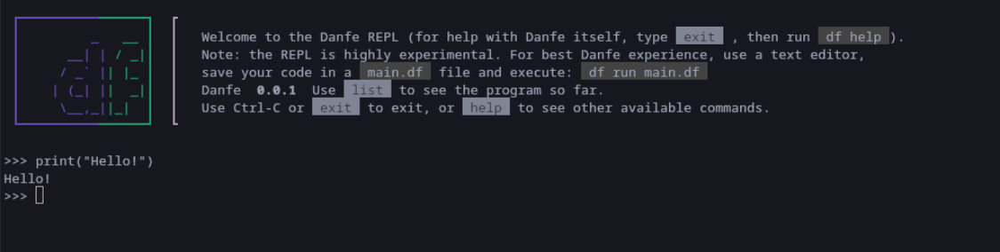

# Repl
A read–eval–print loop (REPL), also termed an interactive toplevel or language shell, is a simple interactive computer programming environment that takes single user inputs, executes them, and returns the result to the user; a program written in a REPL environment is executed piecewise. [Wikipedia](https://en.wikipedia.org/wiki/Read%E2%80%93eval%E2%80%93print_loop) <br>

Danfe also implements it's own **REPL**.
You can view the repl by:
```bash
danfe
```
Output:
